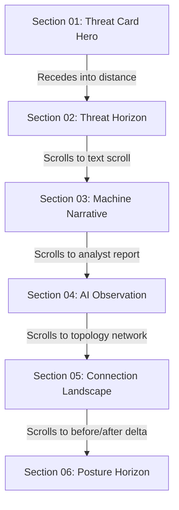

# VulnSentry AI — Design Board Verdict & Implementation Blueprint

**To:** VulnSentry AI Development Lead  
**From:** Joint Review Board  
*   **Apple Human Interface Design Team** (Aesthetic refinement & storytelling)
*   **Awwwards Site of the Day Jury** (Micro-interactions & visual pacing)
*   **Stripe Product Design Leadership** (Precision typography & layout craftsmanship)
*   **Linear Product Team** (Ergonomic layout & performance metrics)
*   **Former NASA Mission Visualization Specialists** (Telemetry spatial mapping)
*   **Senior Frontend Architects** (Dependency control & rendering performance)
*   **Motion Design Directors** (Transition physics & cinematic timing)

---

## 1. Final Visual Direction: After Dark Editorial

The visual design of VulnSentry AI must command immediate authority. It is not a tool; it is a cinematic presentation of a machine's digital health.

```
┌──────────────────────────────────────────────────────────┐
│                    DARK OCEAN CANVAS                     │
│                                                          │
│  [Light Source / Cursor] ──► (Glows over Delaunay mesh)  │
│                                                          │
│     * Deep Charcoal (#070A13)                            │
│     * Midnight Slate (#0D111A)                           │
│     * Radial Luminescence (Deep Ocean Teal)              │
│                                                          │
│  ┌──────────────────┐      ┌─────────────────────────┐   │
│  │   THREAT CARD    │      │    EDITORIAL BRIEFING   │   │
│  │ (3D Tilt Effect) │      │ (Asymmetric Typo Grid)  │   │
│  └──────────────────┘      └─────────────────────────┘   │
└──────────────────────────────────────────────────────────┘
```

### Visual Attributes
*   **Atmosphere:** Deep Dark Ocean. Backgrounds utilize dark slates (`#070a13`, `#0b0f19`) layered with dynamic radial gradients simulating underwater luminescence. No pure blacks; instead, use saturated indigo-charcoals.
*   **Luxury Contrast:** Elements sit on ultra-thin border glass panels (`border-white/[0.04] bg-white/[0.01] backdrop-blur-xl`). Buttons and badges glow softly without neon bleeding.
*   **Color Discipline:** Traditional cybersecurity neon greens and cyans are prohibited. Alert indicators must use curated, high-end tones:
    *   **Critical Risk:** Crimson Rust (`#E11D48` / `#EF4444`)
    *   **High Risk:** Deep Terracotta (`#F97316`)
    *   **Medium Risk:** Muted Ochre (`#F59E0B`)
    *   **Low Risk/Secure:** Pale Seafoam (`#10B981`)
    *   **Muted Elements:** Deep Steel (`#475569`)

---

## 2. Section-by-Section Experience Blueprint

The application is structured as a continuous vertical canvas. As the user scrolls, the interface transforms to present a cohesive narrative: **Observe → Understand → Improve → Verify**.



### Section 01: Threat Card Hero
*   **The Experience:** A single, large, central interactive threat card floats in a Delaunay triangular grid background. The card responds to mouse movements via a 3D tilt effect.
*   **Visual Delivery:** Immediate exposure of the machine's risk posture. A large, bold score (e.g., `58`) glows in the center. A triangle light cursor effect illuminates the Delaunay grid behind it as the mouse moves.
*   **Assets Hook:** Embeds `tools/tilt.js` for mouse-hover angles and binds to the Delaunay canvas generated by `tools/triangles and lights movement`.

### Section 02: Threat Horizon
*   **The Experience:** As the user scrolls, the threat card doesn't slide out or fade; instead, it recedes into the background. The card scales down (`scale(0.35)`) and shifts along a 3D Z-axis (`translate3d(0, 0, -400px)`), converting from a hero element into a distant status indicator.
*   **Visual Delivery:** Gives a physical, spatial feeling of traversing a landscape. The dashboard recedes to reveal the telemetry beneath it.

### Section 03: Machine Narrative
*   **The Experience:** A Spotify-style lyric progression. A column of text details the host machine's telemetry status line-by-line (e.g., *"Evaluating network sockets..."*, *"Scanning local TCP ports..."*, *"Mapping active system processes..."*).
*   **Visual Delivery:** Text lines scroll vertically. The current active line glows in crisp high-contrast silver-white; all other inactive lines are heavily muted (`opacity: 0.15`) with a transition timing of 500ms.

### Section 04: AI Observation
*   **The Experience:** An editorial intelligence briefing presenting the findings of the scan. Layout is asymmetric, utilizing bold header weights and editorial layout breaks.
*   **Visual Delivery:** Absolutely no chat interfaces or agent avatars. The AI's summary displays as a published briefing paper. It reads like a luxury tech journal, presenting a single, clear, high-impact recommendation block.

### Section 05: Connection Landscape
*   **The Experience:** A clean, minimal network topology map showing loopback and interface connections.
*   **Visual Delivery:** A crisp, thin-lined SVG node network. Edge lines pulse with tiny dashes (`stroke-dasharray` animations) representing connection traffic. Glowing points mark open database or shell processes. Click events on process nodes slide out the finding details from the right.

### Section 06: Security Posture Horizon
*   **The Experience:** The final verification step. A side-by-side comparison displays the "Before Scan" vs. "After Scan" telemetry.
*   **Visual Delivery:** The posture score counter animates from its initial state to its post-remediation state (e.g., `58 → 87`). The score counts up incrementally while the resolved nodes vanish in a slow, elegant green pulse.

---

## 3. Typography Recommendation System

A dual-font pairing strategy is enforced to guarantee a balance between editorial luxury and technical precision.

```
┌────────────────────────────────────────────────────────┐
│                        TYPOGRAPHY                      │
│                                                        │
│   EDITORIAL HEADINGS & KEYWORDS                        │
│   ┌────────────────────────────────────────────────┐   │
│   │ Outfit / Playfair Display                      │   │
│   │ "Your machine is talking."                     │   │
│   └────────────────────────────────────────────────┘   │
│                                                        │
│   TECHNICAL TELEMETRY & SYSTEM DETAILS                 │
│   ┌────────────────────────────────────────────────┐   │
│   │ JetBrains Mono / Fira Code                     │   │
│   │ pid: 4821 | port: 3306 | net stop MySQL        │   │
│   └────────────────────────────────────────────────┘   │
└────────────────────────────────────────────────────────┘
```

*   **Primary Display (Editorial, Elegant):** `Outfit` or `Playfair Display`. Used for titles, hero score displays, section headers, and key phrases in the Machine Narrative.
*   **Secondary Mono (Technical, Highly Readable):** `JetBrains Mono` or `Fira Code`. Used for ports, PID listings, file paths, command scripts, and terminal code blocks.
*   **Body & Labels (Minimal Modern):** `Inter` or standard `system-ui`. Used for list descriptions, metadata badges, and paragraphs.

---

## 4. Motion Design System

Animations must be slow, heavy, and atmospheric. Rapid spring animations or fast gaming transitions are prohibited.

```
Transition Curve:
Ease-Out-Expo (Apple-standard feel)
cubic-bezier(0.16, 1, 0.3, 1)

───► Slow start, smooth deceleration ───►
```

*   **Standard Transition Curve:** `cubic-bezier(0.16, 1, 0.3, 1)` (ease-out-expo). This provides a premium, responsive feel with a long, elegant deceleration tail.
*   **Section Recessive Horizon (Z-axis Recede):** `1200ms` transition duration.
*   **Details Panel Slide-Over:** `600ms` translate animation with a backdrop fade of `800ms`.
*   **Lyric Line Activation:** `400ms` transition on color and opacity.
*   **Score Counter Tick Speed:** Increment of `1` unit per `150ms`.

---

## 5. Interaction Design System

*   **Tilt Hover:** Hovering the Threat Card hero tilts it on both the X and Y axes up to a hard-capped `8 degrees`, shifting shadows to simulate an elevated card relative to the canvas.
*   **Cursor Light Follow:** The pointer movements update the position of the light source in the Delaunay canvas background, causing triangles within a `250px` radius of the cursor to catch highlights.
*   **Process Detail Slide-In:** Clicking a topology node slides the Finding Detail panel in from the right edge, overlaying 30% of the screen.
*   **Immediate Copy Feedback:** Clicking a remediation command copies it to the clipboard, changing the button text to a simple, elegant checkmark icon and triggering a slow fade-out alert.

---

## 6. Asset Reuse Strategy

*   **`tools/tilt.js`:** Treat the logic of this script as the source of truth for cards. Wrap its calculation into a React-friendly hook or dynamic inline event listener on the Hero Card element.
*   **`tools/triangles and lights movement`:** The Delaunay triangulation logic inside `js/script.js` is the approved visual background engine. Wrap this engine into a dedicated `DelaunayBackground` canvas component to handle canvas resizing and rendering on the React page.
*   **Existing Endpoints:** Do not alter the API structure. Bind `useLiveStream.ts` directly to the `/api/live/connections` SSE feed, and `useScan.ts` to `/api/scan` and its status stream.

---

## 7. One-Day Build Feasibility Audit

A comprehensive review of the project files indicates that the backend is fully functional and ready to serve data. The frontend is currently a blank canvas. 

**Feasibility Rating: HIGH (with disciplined execution)**
*   **Backend Readiness:** 100%. Endpoints for live connections, scanning, findings details, and remediation are fully coded and tested.
*   **Frontend Scope:** The components directory is structurally empty. React files need to be authored to consume the existing API endpoints.
*   **Risk Mitigation:** The single-page layout simplifies state. All telemetry, scores, and details can be managed in a simple global state container inside [App.tsx](file:///d:/WebProjects/VulnSentry%20AI/frontend/src/App.tsx) or passed down to stateless UI sections.

---

## 8. Critical Components To Build First

To hit the demo milestone quickly, implement the following components in priority order:

1.  **[index.css](file:///d:/WebProjects/VulnSentry%20AI/frontend/src/index.css) (Global Design Tokens):** Define color palettes, font imports (`Outfit`, `JetBrains Mono`), glassmorphic panels, and the ease-out transition utilities.
2.  **`DelaunayBackground.tsx` (Background Canvas):** Port the triangle light physics from `tools/triangles and lights movement` into a React background component to establish the visual atmosphere immediately.
3.  **[useLiveStream.ts](file:///d:/WebProjects/VulnSentry%20AI/frontend/src/hooks/useLiveStream.ts) & [useScan.ts](file:///d:/WebProjects/VulnSentry%20AI/frontend/src/hooks/useScan.ts) (SSE State Hooks):** Wire up connection streams and scan triggers.
4.  **[App.tsx](file:///d:/WebProjects/VulnSentry%20AI/frontend/src/App.tsx) (Global State Shell):** Create the single-page vertical scroll structure with scroll-based section transitions.
5.  **`TopologyMap.tsx` & `FindingsList.tsx` (Core Views):** Implement the interactive network graph and the ranked findings rows.

---

## 9. Elements To Cut If Time Becomes Limited

If the 4-day delivery timeline is compressed, execute these contingency cuts in order:

*   **Contingency 01:** Disable interactive SVG canvas panning/zooming. Keep the `TopologyMap` as a centered, responsive static layout with fixed coordinates.
*   **Contingency 02:** Remove the experimental automated fix execution path (`POST /api/remediate/{id}`). Keep the copy-to-clipboard command widget. This eliminates privilege elevation runtime issues on different developer machines.
*   **Contingency 03:** Replace the scroll-driven Z-axis recess animation of Section 02 with a clean, slow fading layout transition.
