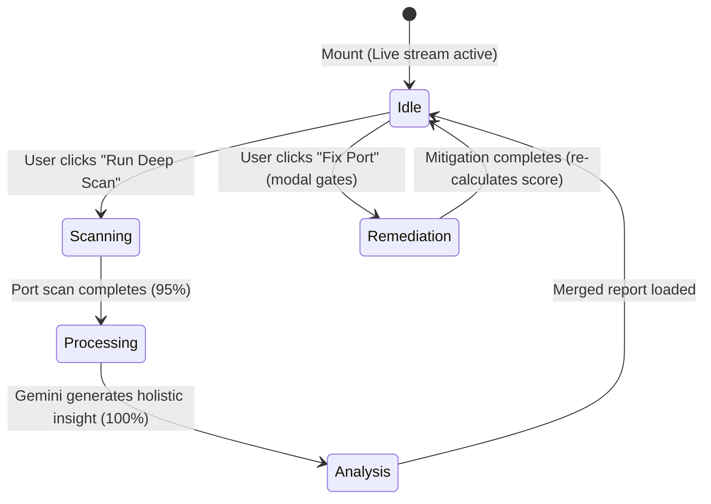

# VulnSentry AI Frontend MVP Implementation Plan

This implementation plan details the React + TypeScript frontend architecture for the VulnSentry AI MVP. It focuses on delivering a visually premium, responsive, and interactive dashboard in under one day of build time, using native Tailwind CSS v4 and SVG elements without heavy WebGL/Three.js frameworks.

---

## User Review Required

> [!IMPORTANT]
> **Tailwind CSS v4 Configuration:** The workspace utilizes Tailwind CSS v4 (`@tailwindcss/vite` plugin). This version does not use a traditional `tailwind.config.js` file but compiles via CSS imports in `src/index.css`.
>
> **Asset Assets:** Lucide React icons are not installed in the current `package.json`. To keep dependencies light and build time minimal, we will use inline SVG icons directly or install `lucide-react` if approved.

---

## Component Tree

The frontend is structured as a single-page reactive application to avoid route overhead and keep state management simple.

```
App.tsx (Global State & SSE Orchestration)
├── Header (Connection status badge, scan trigger button)
├── Main Dashboard (Grid Layout)
│   ├── Left Column: Metrics & Topology Map
│   │   ├── MetricsBar (Circular Posture Score gauge, open port counters)
│   │   └── TopologyMap (Interactive SVG connection map with pulsing nodes)
│   └── Right Column: Actionable Findings
│       ├── AiInsightBanner (Holistic recommendations card)
│       └── FindingsList (Ranked, color-coded rows with severity badges)
└── FindingDetailPanel (Slide-over right sidebar)
    ├── ProcessContext (PID, name, full exe path)
    ├── TeachBlock (Educational context explaining the risk)
    ├── RemediationAction (Dry run, clipboard commands, gated execution)
    └── ExplainMore (Lazy loaded deep explanation toggle)
```

---

## File Structure

```
frontend/
├── src/
│   ├── assets/               # Static media
│   ├── components/
│   │   ├── AiInsightBanner.tsx
│   │   ├── FindingDetailPanel.tsx
│   │   ├── FindingsList.tsx
│   │   ├── Header.tsx
│   │   ├── MetricsBar.tsx
│   │   └── TopologyMap.tsx
│   ├── hooks/
│   │   ├── useLiveStream.ts  # Handles SSE /api/live/connections
│   │   └── useScan.ts        # Handles REST POST /api/scan & SSE status stream
│   ├── types/
│   │   └── finding.ts        # Shared TypeScript typings
│   ├── App.css
│   ├── App.tsx               # Orchestrates global state, handles hooks integration
│   ├── index.css             # Tailwind v4 directives and theme variables
│   └── main.tsx
├── package.json
└── vite.config.ts
```

---

## Page Layout & Design Aesthetics

The interface is divided into a three-column grid at `lg` screen width for maximum space utilization. It features a curated **dark-cyberpunk theme**:

* **Background:** Deep dark slate (`bg-[#0B0F19]`) with subtle glassmorphic container borders (`border-white/[0.06] bg-white/[0.02] backdrop-blur-md`).
* **Visual Anchors:**
  * **Circular Posture Score Gauge:** Renders an animated SVG circle. Green (`#22C55E`) for score $\ge 80$, Amber (`#EAB308`) for $50\text{--}79$, and Red (`#EF4444`) for $< 50$.
  * **SVG Topology Map:** A central "Local Host" hub with radiating nodes corresponding to active processes. Nodes pulse and scale based on severity, rendering connected edges using animated dash arrays (`stroke-dasharray` CSS animation) to simulate traffic flow.
  * **Detail Drawer:** Slides smoothly from the right edge, overlaying part of the dashboard.

---

## State Flow



### State Variables in `App.tsx`
* `connections: Connection[]` — Polled/streamed from `/api/live/connections`.
* `scanState: ScanState` — Tracks deep scan status (`idle | running | complete | error`), progress %, and phase.
* `currentReport: ScanReport | null` — Stores the completed scan results and deltas.
* `selectedFindingId: string | null` — ID of the finding opened in the detail drawer.
* `remedyResult: RemediationResult | null` — Tracks background command execution feedback.

---

## Build Order (1-Day Implementation Schedule)

### Phase 1: Models & Hooks (2 Hours)
1. Complete types in [finding.ts](file:///d:/WebProjects/VulnSentry%20AI/frontend/src/types/finding.ts).
2. Write SSE stream parser in [useLiveStream.ts](file:///d:/WebProjects/VulnSentry%20AI/frontend/src/hooks/useLiveStream.ts).
3. Write scan dispatcher and status stream listener in [useScan.ts](file:///d:/WebProjects/VulnSentry%20AI/frontend/src/hooks/useScan.ts).

### Phase 2: Static Components & Layout (2.5 Hours)
1. Implement [Header.tsx](file:///d:/WebProjects/VulnSentry%20AI/frontend/src/components/Header.tsx) and [MetricsBar.tsx](file:///d:/WebProjects/VulnSentry%20AI/frontend/src/components/MetricsBar.tsx).
2. Build [FindingsList.tsx](file:///d:/WebProjects/VulnSentry%20AI/frontend/src/components/FindingsList.tsx) showing severity rankings.
3. Integrate layout grid in [App.tsx](file:///d:/WebProjects/VulnSentry%20AI/frontend/src/App.tsx).

### Phase 3: Interactive Topology & Detail Panel (3 Hours)
1. Create [TopologyMap.tsx](file:///d:/WebProjects/VulnSentry%20AI/frontend/src/components/TopologyMap.tsx) as an SVG-based node-edge coordinate system.
2. Build [FindingDetailPanel.tsx](file:///d:/WebProjects/VulnSentry%20AI/frontend/src/components/FindingDetailPanel.tsx) with lazy loading for Gemini Teach blocks and remediation confirmation modals.
3. Add [AiInsightBanner.tsx](file:///d:/WebProjects/VulnSentry%20AI/frontend/src/components/AiInsightBanner.tsx).

### Phase 4: Integration & Transitions (1.5 Hours)
1. Tie SSE streaming triggers together in `App.tsx`.
2. Implement CSS transition states for the slide-over drawer.
3. Test layout responsiveness and local server API loop.

---

## Verification Plan

### Manual Verification
1. Run local dev server: `npm run dev` in the frontend directory.
2. Verify Live Connection Stream: Confirm the topology map updates and shows connections (e.g. Chrome, internal processes) without clicking scan.
3. Trigger Deep Scan: Confirm the progress bar runs and streams results.
4. Verify Details Drawer: Click a node or findings row; verify description and LLM teach blocks load.
5. Verify Remediation: Click the remediation action, confirm the modal, and verify that the posture score updates immediately on completion.
