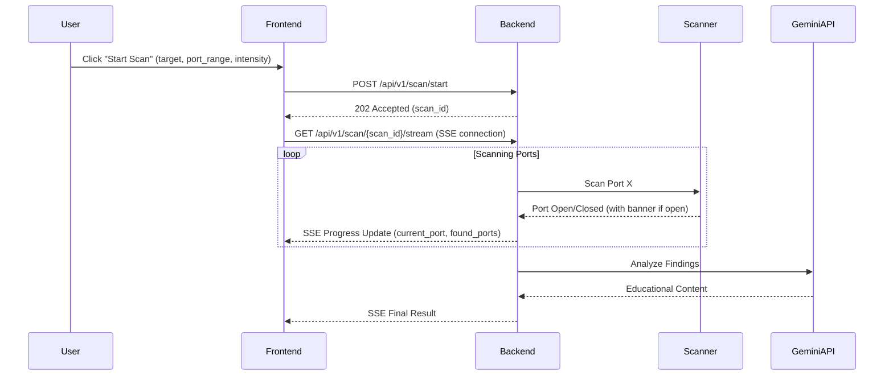
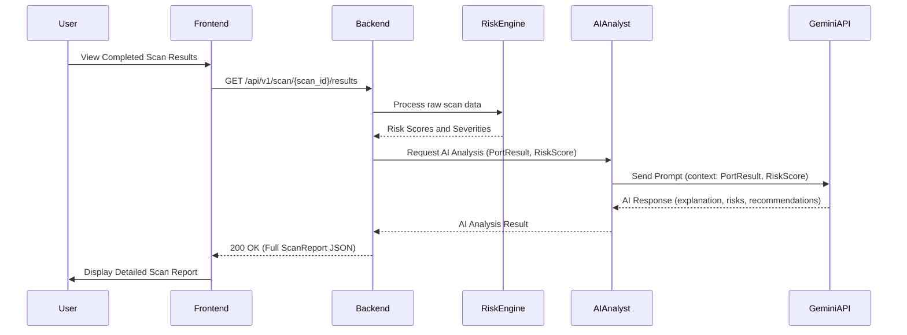

# Technical Requirements Document: VulnSentry AI

**Document Version:** 1.0
**Date:** June 17, 2026
**Author:** Manus AI

## 1. System Overview
VulnSentry AI is a distributed application consisting of a React-based frontend and a FastAPI-based backend. The system is designed to run locally on a user's machine to scan and analyze the security of `localhost` and private subnets. The backend leverages asynchronous I/O for high-performance port scanning and integrates with the Gemini API for intelligent security analysis.

## 2. Architecture Overview
The system follows a modern client-server architecture:
- **Frontend:** A Single Page Application (SPA) built with React, TypeScript, and TailwindCSS. It handles user input, displays scan progress, and visualizes results.
- **Backend:** A FastAPI server running on Python 3.11+. It manages the scanning engine, risk scoring logic, and AI communication.
- **AI Layer:** External integration with Google's Gemini API for generating educational content.
- **Communication:** RESTful API for command and control, with Server-Sent Events (SSE) for real-time scan progress updates.

## 3. Technical Goals
- **Concurrency:** Achieve high-speed port scanning using `asyncio` without exhausting system resources (e.g., file descriptors).
- **Extensibility:** Design a modular risk engine that allows for easy addition of new security rules.
- **Reliability:** Ensure robust error handling for network timeouts and AI API failures.
- **User Experience:** Provide immediate feedback through real-time progress updates.
- **Security:** Maintain strict boundaries to prevent unauthorized scanning of external networks.

## 4. Component Breakdown
- **Scan Manager:** Orchestrates the scanning process, including target validation and task scheduling.
- **Port Scanner:** Asynchronous module responsible for identifying open TCP ports.
- **Banner Grabber:** Retrieves service information from open ports.
- **Risk Engine:** Evaluates identified services against a set of predefined security rules.
- **AI Analyst:** Handles communication with the Gemini API, including prompt engineering and response parsing.
- **Report Generator:** Formats scan results and analysis into structured JSON.
- **Dashboard UI:** React components for input, progress tracking, and data visualization.

## 5. Backend Module Specifications
- **Scanner Module (`scanner.py`):**
    - Uses `asyncio.open_connection` for non-blocking TCP probes.
    - Implements a semaphore to limit concurrent connections (default: 100).
    - Configurable timeout per port (default: 1.0s).
- **Risk Module (`risk_engine.py`):**
    - Rule-based system using a dictionary of known risky ports and banners.
    - Scoring logic: `0` (Low) to `10` (Critical).
- **AI Module (`ai_analyst.py`):**
    - Uses `google-generativeai` SDK.
    - Implements retry logic for rate-limited requests.
    - Prompt template focusing on educational explanation and remediation.

## 6. Frontend Module Specifications
- **Scan Dashboard:**
    - State-driven UI for "Idle", "Scanning", and "Completed" states.
    - Real-time progress bar utilizing SSE.
- **Result Viewer:**
    - Categorized view of open ports (Critical, Warning, Informational).
    - Detailed modal for AI-generated security advice.
- **Settings/Config:**
    - Input fields for target IP/subnet and scan intensity.

## 7. API Contract Definitions
### `POST /api/v1/scan/start`
- **Request Body:** 
```json
{
  "target": "127.0.0.1",
  "port_range": [1, 1000],
  "intensity": "standard"
}
```
- **Response:** `{ "scan_id": "uuid-v4", "status": "initiated" }`

### `GET /api/v1/scan/{scan_id}/stream`
- **Response:** `text/event-stream` delivering progress updates.
```json
{
  "progress": 45.5,
  "current_port": 443,
  "found_ports": [{"port": 80, "status": "open"}]
}
```

### `GET /api/v1/scan/{scan_id}/results`
- **Response:** Full scan report including AI analysis and risk scores.

## 8. Data Models
- **ScanTarget:** Represents the target for a scan, including IP address or CIDR range. This will be a Pydantic model in the backend for validation.
- **PortResult:** Encapsulates information about a single scanned port: port number, protocol (TCP), state (open/closed/filtered), and any retrieved service banner. This will also be a Pydantic model.
- **SecurityFinding:** Extends `PortResult` by adding a calculated risk score, severity level, and the AI-generated explanation and recommendations. This is the core data structure for presenting findings.
- **ScanReport:** A comprehensive report containing metadata about the scan (timestamp, target, scan ID), a summary of findings (counts by severity), and a list of `SecurityFinding` objects. This will be the final output structure.

## 9. Type Definitions
```typescript
type Severity = 'low' | 'medium' | 'high' | 'critical';

interface AIAnalysis {
  explanation: string;
  risks: string[];
  recommendations: string[];
}

interface PortResult {
  port: number;
  protocol: 'tcp';
  state: 'open' | 'closed' | 'filtered' | 'unreachable';
  service: string | null;
  banner: string | null;
}

interface SecurityFinding extends PortResult {
  riskScore: number;
  severity: Severity;
  aiAnalysis: AIAnalysis;
}

interface ScanStatusUpdate {
  scanId: string;
  progress: number;
  currentPort: number | null;
  totalPorts: number;
  foundPorts: PortResult[];
  status: 'pending' | 'running' | 'completed' | 'failed';
}

interface ScanReport {
  scanId: string;
  target: string;
  timestamp: string; // ISO 8601 format
  summary: {
    totalPortsScanned: number;
    openPortsFound: number;
    criticalFindings: number;
    highFindings: number;
    mediumFindings: number;
    lowFindings: number;
  };
  findings: SecurityFinding[];
}
```

## 10. JSON Schemas
### Scan Request Schema (`POST /api/v1/scan/start`)
```json
{
  "$schema": "http://json-schema.org/draft-07/schema#",
  "title": "ScanRequest",
  "type": "object",
  "properties": {
    "target": {
      "type": "string",
      "description": "IP address or CIDR range to scan (e.g., 127.0.0.1, 192.168.1.0/24)",
      "pattern": "^((25[0-5]|2[0-4][0-9]|[01]?[0-9][0-9]?)\\.){3}(25[0-5]|2[0-4][0-9]|[01]?[0-9][0-9]?)(/(8|12|16|24))?$" 
    },
    "port_range": {
      "type": "array",
      "description": "Start and end port for scanning (e.g., [1, 1000])",
      "items": { "type": "integer", "minimum": 1, "maximum": 65535 },
      "minItems": 2,
      "maxItems": 2
    },
    "intensity": {
      "type": "string",
      "description": "Scan intensity: 'standard' (Top 1000 ports) or 'full' (all 65535 ports)",
      "enum": ["standard", "full"],
      "default": "standard"
    }
  },
  "required": ["target"]
}
```

### Scan Status Update Schema (SSE Stream)
```json
{
  "$schema": "http://json-schema.org/draft-07/schema#",
  "title": "ScanStatusUpdate",
  "type": "object",
  "properties": {
    "scanId": { "type": "string", "format": "uuid", "description": "Unique identifier for the scan" },
    "progress": { "type": "number", "minimum": 0, "maximum": 100, "description": "Current scan progress percentage" },
    "currentPort": { "type": ["integer", "null"], "minimum": 1, "maximum": 65535, "description": "The port currently being scanned" },
    "totalPorts": { "type": "integer", "minimum": 0, "description": "Total number of ports to be scanned" },
    "foundPorts": {
      "type": "array",
      "description": "List of ports found open so far",
      "items": {
        "type": "object",
        "properties": {
          "port": { "type": "integer", "minimum": 1, "maximum": 65535 },
          "state": { "type": "string", "enum": ["open", "closed", "filtered", "unreachable"] },
          "service": { "type": ["string", "null"] },
          "banner": { "type": ["string", "null"] }
        },
        "required": ["port", "state"]
      }
    },
    "status": {
      "type": "string",
      "enum": ["pending", "running", "completed", "failed"],
      "description": "Current status of the scan"
    }
  },
  "required": ["scanId", "progress", "totalPorts", "status"]
}
```

### Security Finding Schema (Nested within Scan Report)
```json
{
  "$schema": "http://json-schema.org/draft-07/schema#",
  "title": "SecurityFinding",
  "type": "object",
  "properties": {
    "port": { "type": "integer", "minimum": 1, "maximum": 65535, "description": "Port number" },
    "protocol": { "type": "string", "enum": ["tcp"], "description": "Protocol of the port" },
    "state": { "type": "string", "enum": ["open", "closed", "filtered", "unreachable"], "description": "State of the port" },
    "service": { "type": ["string", "null"], "description": "Identified service running on the port" },
    "banner": { "type": ["string", "null"], "description": "Service banner information" },
    "riskScore": { "type": "integer", "minimum": 0, "maximum": 10, "description": "Calculated risk score (0-10)" },
    "severity": { "type": "string", "enum": ["low", "medium", "high", "critical"], "description": "Severity level of the finding" },
    "aiAnalysis": {
      "type": "object",
      "properties": {
        "explanation": { "type": "string", "description": "AI-generated explanation of the risk" },
        "risks": { "type": "array", "items": { "type": "string" }, "description": "List of potential risks" },
        "recommendations": { "type": "array", "items": { "type": "string" }, "description": "List of hardening recommendations" }
      },
      "required": ["explanation", "risks", "recommendations"]
    }
  },
  "required": ["port", "protocol", "state", "riskScore", "severity", "aiAnalysis"]
}
```

### Scan Report Schema (`GET /api/v1/scan/{scan_id}/results`)
```json
{
  "$schema": "http://json-schema.org/draft-07/schema#",
  "title": "ScanReport",
  "type": "object",
  "properties": {
    "scanId": { "type": "string", "format": "uuid", "description": "Unique identifier for the scan" },
    "target": { "type": "string", "description": "Target IP address or CIDR range" },
    "timestamp": { "type": "string", "format": "date-time", "description": "Timestamp of when the scan was completed (ISO 8601)" },
    "summary": {
      "type": "object",
      "properties": {
        "totalPortsScanned": { "type": "integer", "minimum": 0 },
        "openPortsFound": { "type": "integer", "minimum": 0 },
        "criticalFindings": { "type": "integer", "minimum": 0 },
        "highFindings": { "type": "integer", "minimum": 0 },
        "mediumFindings": { "type": "integer", "minimum": 0 },
        "lowFindings": { "type": "integer", "minimum": 0 }
      },
      "required": ["totalPortsScanned", "openPortsFound", "criticalFindings", "highFindings", "mediumFindings", "lowFindings"]
    },
    "findings": {
      "type": "array",
      "description": "Detailed list of security findings",
      "items": { "$ref": "#/definitions/SecurityFinding" }
    }
  },
  "required": ["scanId", "target", "timestamp", "summary", "findings"],
  "definitions": {
    "SecurityFinding": { "$ref": "#/components/schemas/SecurityFinding" } 
  }
}
```

## 11. Scanner Workflow
1. **Validation:** The `Scan Manager` receives a scan request. It first validates the `target` against `127.0.0.1/32` or RFC 1918 private ranges (`10.0.0.0/8`, `172.16.0.0/12`, `192.168.0.0/16`). If the target is a hostname, it's resolved to an IP address. If the target is invalid or outside allowed ranges, the request is rejected.
2. **Task Creation:** Based on the `port_range` and `intensity` (standard/full), a list of ports to scan is generated. For `standard` intensity, a predefined list of Top 1000 common ports is used. For `full` intensity, all 65535 TCP ports are considered.
3. **Async Execution:** The `Port Scanner` module initiates asynchronous TCP connection attempts to each port in the generated list. It uses `asyncio.gather` with a `asyncio.Semaphore` to limit the number of concurrent connections, preventing resource exhaustion. Each connection attempt has a configurable timeout (default: 1.0s).
4. **Banner Grabbing:** For each port that successfully establishes a connection (i.e., is found to be 'open'), the `Banner Grabber` attempts a short-lived read operation on the socket to retrieve any initial service banner information. This information (e.g., HTTP server version, SSH protocol version) is crucial for subsequent risk analysis.
5. **State Update:** As ports are scanned and results (open/closed/filtered/unreachable) are determined, the `Scan Manager` emits progress updates via Server-Sent Events (SSE) to the frontend. These updates include the `scanId`, current `progress` percentage, the `currentPort` being processed, the `totalPorts` to be scanned, and a list of `foundPorts` (open ports with their banners) discovered so far.

## 12. Risk Engine Workflow
1. **Rule Matching:** The `Risk Engine` receives `PortResult` objects (port number, protocol, service, banner) for all identified open ports. It then compares this information against a local `rules.json` configuration file. This file contains predefined rules based on common vulnerabilities, default configurations, and known risky services (e.g., unauthenticated databases, outdated SSH versions).
2. **Score Calculation:** Each rule has an associated base risk score. When a match occurs, a base risk score (on a scale of 0-10) is assigned to the `SecurityFinding`. Modifiers are applied based on specific banner information (e.g., an outdated service version might increase the score, while a specific secure configuration might decrease it).
3. **Severity Mapping:** The final calculated risk score is mapped to a human-readable severity level:
    - **0-2:** Low (e.g., informational ports, well-configured common services)
    - **3-5:** Medium (e.g., common services with minor misconfigurations, older but not critical versions)
    - **6-8:** High (e.g., services with known vulnerabilities, unencrypted sensitive protocols)
    - **9-10:** Critical (e.g., unauthenticated critical services, highly vulnerable versions)

## 13. AI Analysis Workflow
1. **Context Preparation:** For each `SecurityFinding` (which includes `PortResult`, risk score, and severity), the `AI Analyst` serializes this data into a concise JSON format. This structured data forms the context for the AI prompt.
2. **Prompt Generation:** A carefully crafted system prompt is used to instruct the Gemini API. This prompt enforces an "Educational Cybersecurity Mentor" persona, guiding the AI to:
    - Explain the security concern in simple, beginner-friendly language.
    - Detail the potential implications and risks associated with the finding.
    - Provide practical, actionable hardening recommendations.
    - Avoid technical jargon where possible or explain it clearly.
3. **API Call:** The prepared context and prompt are sent to the Gemini Pro API using the `google-generativeai` SDK. The API call is asynchronous to avoid blocking the main application thread.
4. **Post-Processing:** Upon receiving the AI response, the `AI Analyst` validates its JSON structure to ensure it contains the expected `explanation`, `risks` (as a list of strings), and `recommendations` (as a list of strings) fields. All text content within the AI response is then sanitized to prevent any potential injection attacks or unexpected rendering issues when displayed in the frontend UI.

## 14. Dashboard State Management
- **Scan Context:** A React Context (`ScanContext.tsx`) will be implemented to manage the global state related to the current scan. This context will store the `scanId`, its overall `status` (`pending`, `running`, `completed`, `failed`), the `progress` percentage, and a list of partial `ScanResult` objects that are updated in real-time.
- **SSE Hook:** A custom React hook (`useScanStream.ts`) will be developed to manage the `EventSource` connection to the backend's `/api/v1/scan/{scan_id}/stream` endpoint. This hook will listen for incoming SSE messages, parse the `ScanStatusUpdate` JSON, and dispatch updates to the `ScanContext`, triggering re-renders of relevant UI components.
- **Local Storage:** The `scanId` of the last completed scan will be persisted in the browser's `localStorage`. This allows users to revisit previous scan results even if they close and reopen the application, providing a basic form of session recovery without requiring a backend database.

## 15. Error Handling Strategy
- **Backend:** A global exception handler will be implemented in FastAPI (`app/core/exceptions.py`) to catch all unhandled exceptions. This handler will ensure that all errors are logged internally and that standardized JSON error responses (e.g., `400 Bad Request`, `403 Forbidden`, `500 Internal Server Error`) are returned to the frontend, providing consistent error communication.
- **Scanner:** The `Port Scanner` module will gracefully handle network-related errors. `ConnectionRefusedError` and `TimeoutError` will be caught and mapped to specific `PortResult` states like "closed" or "filtered". `socket.gaierror` (hostname resolution failure) will result in the target being marked as "unreachable". Transient network issues will be mitigated by implementing retries with exponential backoff for connection attempts.
- **AI Layer:** Robust retry logic with exponential backoff will be implemented for `429 Too Many Requests` (rate limiting) and `5xx` errors received from the Gemini API. If the AI API is persistently unavailable or returns an unparseable response after retries, a fallback mechanism will provide generic educational content or a clear error message to the user.
- **Frontend:** The frontend will display user-friendly error messages for API failures, network issues, and invalid input. React Error Boundaries will be used to prevent entire application crashes due to component-level errors, ensuring a resilient user experience.

## 16. Security Constraints
- **Localhost Only Binding:** The FastAPI backend MUST bind exclusively to `127.0.0.1` (and `::1` for IPv6) to prevent any external network access to the scanning capabilities. This ensures the tool remains strictly for local environment auditing.
- **Target Filtering Middleware:** A FastAPI middleware (`app/core/security.py`) MUST intercept all scan requests. This middleware will strictly verify that the `target` IP address or CIDR range falls within the RFC 1918 private address spaces (`10.0.0.0/8`, `172.16.0.0/12`, `192.168.0.0/16`) or `127.0.0.1/32`. Any attempt to scan an external or public IP address will be rejected with a `403 Forbidden` HTTP response.
- **Content Sanitization:** All AI-generated content and any user-provided inputs MUST be treated as untrusted data. Frontend components MUST rigorously sanitize and escape all dynamic content before rendering it in the UI to prevent Cross-Site Scripting (XSS) attacks.
- **Resource Limits:** Internal rate limiting and connection limits will be implemented within the `Port Scanner` module to prevent resource exhaustion (e.g., too many open file descriptors, excessive CPU usage) that could lead to a denial of service on the local machine where VulnSentry AI is running.

## 17. Input Validation Rules
- **IP Address:** The `target` field, if provided as an IP address, must be a valid IPv4 or IPv6 address. This validation will be enforced using Python's `ipaddress` module in the backend and a robust regex pattern in the frontend to provide immediate feedback.
- **CIDR:** If a CIDR range is provided for the `target`, it must be a valid CIDR notation (e.g., `192.168.1.0/24`) and fall within the allowed private ranges (`10.0.0.0/8`, `172.16.0.0/12`, `192.168.0.0/16`). For the MVP, only `/8`, `/12`, `/16`, and `/24` masks will be explicitly supported for private subnets.
- **Port Range:** The `port_range` array in the request body must contain exactly two integers. The `start_port` and `end_port` must satisfy `1 <= start_port <= end_port <= 65535`. The system will ensure that the specified range is valid and does not overlap with any other concurrently running scans (though concurrency is limited in MVP).
- **Intensity:** The `intensity` field must be one of the predefined string values: `"standard"` (which implies scanning the Top 1000 common ports) or `"full"` (implying scanning all 65535 ports). Any other value will result in a validation error.

## 18. Repository Structure
```
vulnsentry-ai/
├── backend/
│   ├── app/
│   │   ├── api/          # FastAPI routes for scan initiation, status, results
│   │   ├── core/         # Security middleware, input validation, exception handlers
│   │   ├── modules/      # Core logic: Scanner, RiskEngine, AIAnalyst
│   │   ├── schemas/      # Pydantic models for request/response validation
│   │   └── main.py       # FastAPI application entry point
│   ├── tests/            # Pytest suite for backend components
│   └── requirements.txt  # Python dependencies
├── frontend/
│   ├── public/           # Static assets (e.g., index.html, favicon)
│   ├── src/
│   │   ├── assets/       # Images, icons, and other static media
│   │   ├── components/   # Reusable UI components (buttons, cards, modals, forms)
│   │   ├── context/      # React Context for global state (e.g., ScanContext, AuthContext if applicable in future)
│   │   ├── hooks/        # Custom React hooks (e.g., useScanStream, useApi, useLocalStorage)
│   │   ├── services/     # API client for interacting with backend (e.g., axios instances, API wrappers)
│   │   ├── views/        # Page-level components (DashboardView, ResultView, SettingsView)
│   │   └── App.tsx       # Main React application component and routing setup
│   ├── tailwind.config.js # Tailwind CSS configuration file
│   └── package.json      # Node.js dependencies and scripts for frontend
└── README.md             # Project overview, setup instructions, and contribution guidelines
```

## 19. Environment Variables
- `GEMINI_API_KEY`: A mandatory API key for authenticating requests to the Google Gemini API. This variable MUST be loaded securely (e.g., from a `.env` file or environment variables) and MUST NOT be committed directly into version control.
- `MAX_CONCURRENT_SCANS`: An integer value defining the maximum number of parallel scan tasks the backend can handle simultaneously. This is a critical setting for resource management, with a default of `1` for the MVP to manage local machine resources effectively.
- `ALLOWED_PRIVATE_RANGES`: A comma-separated string of CIDR ranges (e.g., `10.0.0.0/8,172.16.0.0/12,192.168.0.0/16`) that the scanner is explicitly permitted to target. This provides an additional, configurable layer of security control against accidental or malicious external scanning.
- `DEBUG_MODE`: A boolean flag (`true`/`false`) to enable verbose logging, detailed error messages, and debugging features in both the frontend and backend. Default value should be `false` for production-like deployments.

## 20. Development Workflow
1. **API First Design:** The development process will begin by defining all Pydantic models for data structures and FastAPI routes for API endpoints in the `backend/app/schemas` and `backend/app/api` directories, respectively. This establishes a clear, versioned contract between the frontend and backend, allowing for parallel development.
2. **Mocking for Parallel Development:** Create a `MockScanner` module in the backend that simulates scan results by returning predefined or randomly generated open ports and banners. Similarly, create mock API responses for the Gemini API. This enables frontend developers to build the UI and integrate with the API without waiting for the full backend implementation.
3. **UI Implementation with Mock Data:** Frontend developers will build the dashboard and result viewer components using the mock data. The focus will be on state management, data visualization, user interaction flows, and ensuring a responsive design with TailwindCSS.
4. **Backend Core Integration:** Replace the mock backend modules with the actual `asyncio`-based port scanner and banner grabber implementations. Connect these to the FastAPI endpoints.
5. **AI Integration:** Integrate the `ai_analyst.py` module with the Gemini API, including prompt engineering and response parsing. Connect this to the risk engine and scan result processing.
6. **Testing & Refinement:** Conduct comprehensive unit, integration, and end-to-end tests. Refine UI/UX based on testing feedback and performance profiling.

## 21. Testing Strategy
- **Unit Testing:**
    - **Backend:** Utilize `pytest` for testing individual functions and classes within `scanner.py`, `risk_engine.py`, `ai_analyst.py`, and validation logic in `core/validation.py`. Tests will cover edge cases for port scanning, accuracy of risk scoring calculations, and correctness of AI prompt generation.
    - **Frontend:** Employ `Jest` and `React Testing Library` to test individual React components, custom hooks, and utility functions. Focus on ensuring components render correctly, respond to user interactions as expected, and manage local state appropriately.
- **Integration Testing:**
    - **Backend API:** Use `FastAPI.testclient` to send requests to all API endpoints (`/api/v1/scan/start`, `/api/v1/scan/{scan_id}/stream`, `/api/v1/scan/{scan_id}/results`) and verify correct HTTP responses, status codes, and data formats against the defined JSON schemas.
    - **Frontend-Backend Communication:** Verify that the frontend correctly consumes data from the backend APIs, including processing SSE streams for real-time updates, and accurately updates the UI based on the received data.
- **End-to-End (E2E) Testing:**
    - Utilize `Playwright` or `Cypress` to simulate a full user journey: navigating to the application, entering a target, initiating a scan, observing scan progress, viewing detailed results, and downloading reports. This ensures the entire system functions as a cohesive unit from user interaction to backend processing and data presentation.
- **Mocking:** Extensive use of mocking for external dependencies (e.g., Gemini API, network sockets, file system operations) during unit and integration tests to ensure tests are fast, reliable, and isolated from external factors.

## 22. Build Order
1. **Core Backend Infrastructure:** Establish the FastAPI application, define Pydantic models for all data schemas, and implement basic input validation logic and security middleware.
2. **Scanner Engine:** Implement the asynchronous port scanning and banner grabbing logic within the `scanner.py` module.
3. **Backend API Endpoints:** Develop the `/api/v1/scan/start` endpoint for initiating scans and the SSE `/api/v1/scan/{scan_id}/stream` endpoint for providing real-time progress updates.
4. **Frontend UI Shell:** Build the basic React application structure, including routing, the main dashboard layout, and input forms for scan parameters. Integrate the frontend with the SSE stream to display scan progress.
5. **Risk Engine:** Implement the rule-based risk scoring logic within the `risk_engine.py` module, applying scores and severities to scan findings.
6. **AI Integration:** Integrate the Gemini API into the `ai_analyst.py` module, focusing on prompt engineering and robust parsing of AI responses. Connect this module to the risk engine's output.
7. **Result Visualization & Reporting:** Develop the remaining frontend components to display detailed scan results, AI analysis, and implement the JSON report download functionality.

## 23. Sequence Diagrams
### Scan Initiation and Progress


### Result Retrieval and AI Analysis


## 24. Future Expansion Strategy
- **Plugin Architecture:** Design the `risk_engine.py` to support a plugin-based architecture, allowing new security rules and checks to be loaded dynamically from external YAML or JSON configuration files without requiring code changes. This will enhance the extensibility and maintainability of the risk assessment logic.
- **Provider Agnostic AI:** Implement an `AIBase` abstract class and concrete implementations (e.g., `GeminiAIAnalyst`, `OpenAIAnalyst`, `OllamaAIAnalyst`) to allow easy switching between different LLM providers or even local LLMs. This enhances flexibility, reduces vendor lock-in, and allows for future cost optimization or performance improvements.
- **Mobile Support:** Ensure the frontend UI is built with a responsive design philosophy (e.g., using TailwindCSS breakpoints) to allow for a usable experience on mobile browsers, enabling users to monitor scans from local mobile devices. Consider a future Progressive Web App (PWA) implementation for a more native-like experience.
- **Advanced Scanning:** Introduce support for UDP port scanning, more sophisticated banner parsing (e.g., integrating with `nmap-service-probes` data for more accurate service and version detection), and basic vulnerability checks (e.g., identifying common default credentials for services).
- **Historical Data:** Implement a local, file-based database (e.g., SQLite) for persisting scan results. This will allow users to review past scans, track changes in their local environment's security posture over time, and compare results.
- **Scheduled Scans:** Add functionality to schedule recurring scans of the local environment, providing continuous monitoring and alerting for new or changed security findings.
- **Interactive Remediation:** Develop interactive guides or scripts within the UI to help users apply hardening recommendations directly, further enhancing the educational aspect of the platform.
